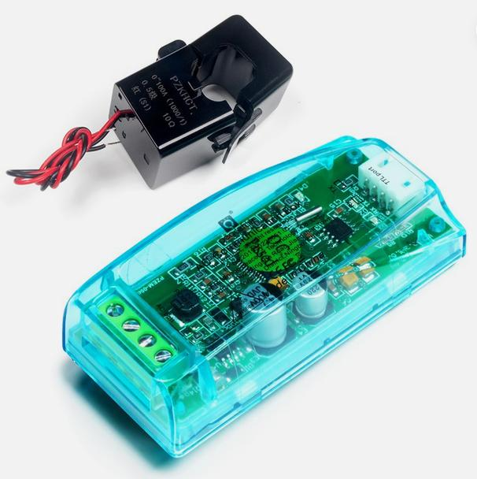
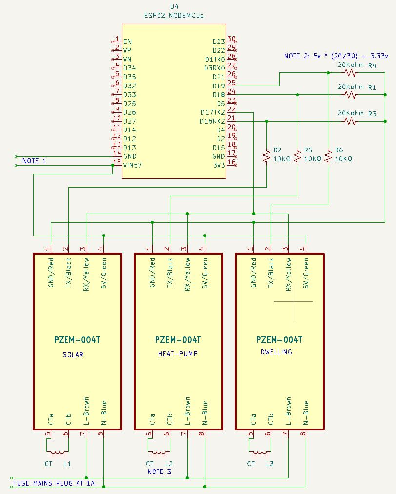
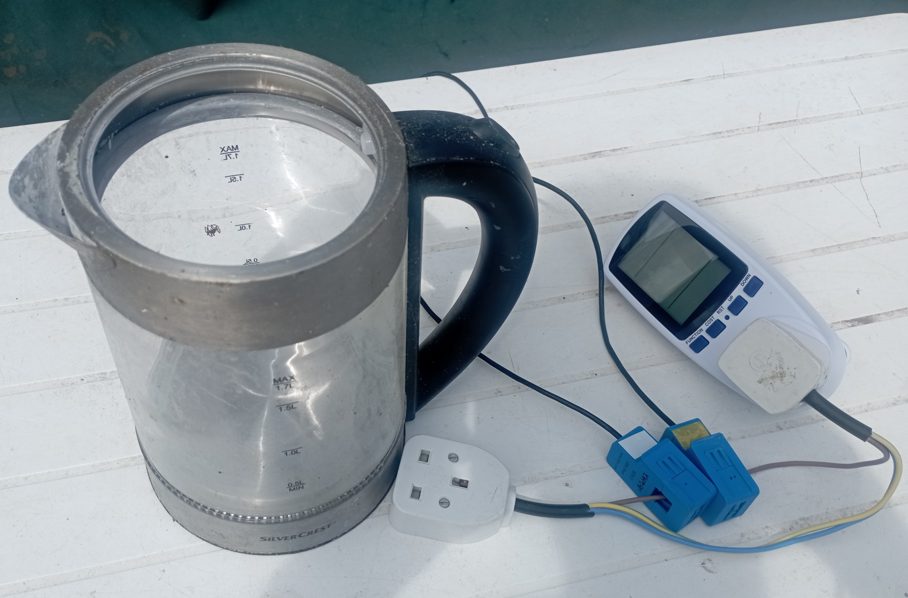
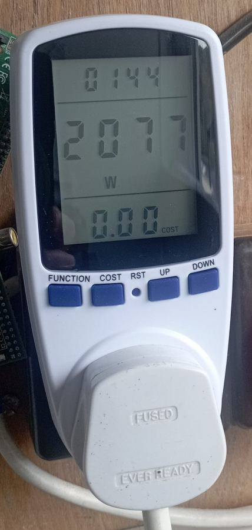
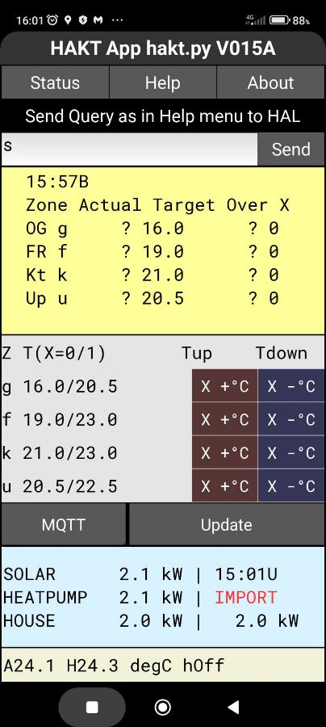

# ct3PZEM

A MicroPython-based electronic project using PZEM energy monitoring modules to measure power being used in various domestic circuits. In this case we wish to measure kilowatts (kW) being generated by a solar panel and used by a heat-pump and, seperately, the rest of the dwelling.

## Equipment

The assembled project showing the ESP32, PZEM module.

## Project Overview

This project uses an ESP32 to obtain electrical measurements via energy monitoring modules. The data can be processed and transmitted to other systems.

## Main Components

- NodeMcu ESP32 WROOM-32 Type C CH340C Development Board Dual Core WiFi Bluetooth
- PZEM-004T AC Voltage Current Test Module plus Open CT 100A (3 needed)
- IP67 Waterproof Electrical Junction Box Outdoor Plastic Enclosure With Hasp Seal transparent cover, 150 mm X 150 mm X 90 mm
- USB mains to USB 5v supply

PZEM-004T units are available on Ebay (£12.43 July 2026 with case)

## Software

- Written in MicroPython
- ct3PZEM.py is main program needing
- other shared modules with filenames starting with mod

## Circuit

Note 1: Under normal operation 5 volts is supplied to the circuit via a USB A to C lead plugged into the ESP32 board. An external mains USB adapter is needed.
For making changes to software this lead can also be plugged into a laptop and used by tools such as Thonny. Xubuntu Operating System was used for development.

Note 2: The PZEM modules use 5 V logic, whereas the ESP32 uses 3.3 V logic. When the PZEM modules transmit data back to the ESP32, resistor dividers reduce the voltage to a safe level for the ESP32's inputs. 
When the ESP32 transmits data to the PZEM modules, the modules are able to correctly decode the lower-voltage 3.3 V logic signals.  

Note 3: CT stands for Current Transformer. https://en.wikipedia.org/wiki/Current_transformer
A CT is supplied with each PZEM-004T board. The CTs are rated at 100 A and have a short twisted-wire cable attached. The cable can be extended if necessary, but should be kept as short as practical. The CTs clip around the mains conductors to measure the current flowing through them.
A CT should be placed around one conductor only, not around both Live and Neutral together, otherwise their opposing magnetic fields cancel each other.
To ensure consistent readings, keep the orientation of all CTs the same. Clip the Heat Pump and Dwelling CTs around the Live (hopefully brown) conductors. For the Solar CT, clip it around the Neutral/return conductor. This arrangement ensures that solar generation produces a positive reading.

## How It Works

Periodically kW power readings are made by scanning each CT. Normally the period is triggered by a minute change however the user can send an Update request that will for a short time send every 10 seconds.
The timestamped data is published to an MQTT server. Any subscriber to the server will then get the data. The time stamp is used at the receiving end to check the data is live.  

## Installation

The ESP32 was programmed using Thonny on a Linux Xubuntu system. Thonny is available for Windows, macOS and Linux, so the same MicroPython development environment can be used regardless of the computer's operating system.
Alternatives exist but Thonny as the simplest cross-platform choice.

## Configuration

Some modules need setting up. A header in each module gives notes on setup.

1) **modWiFi**  
wifi_entries.dat holds WiFi connections credentials. For a fixed system just one line Entry is needed. The format is like:
SSID::PASSWORD::Region
SSID and PASSWORD can contain a large range of characters including a space character.
Region is a single uppercase letter. L=London time and P=Paris time 
The file is then saved in ESP32 flash.

2) **modMQTpub**  
mqcons.py here is a template to be filled in with data from an MQTT server such as HiveMQ, and saved in ESP32 flash.

3) **modDateTime**  
Write the daylight saving string defined at the start of the module
into a file named "dst.rule" and save in ESP32 flash.

## Test Setup

  
A short length of mains cable with live (brown) separated conductor/core has mains plug and socket attached.  
The three CTs attached to the powered up ct3PZEM equipment were clipped onto the brown cable all facing the same way.  
(In photo only two blue CTs are shown)  
A Power Meter (Ebay: LCD Plug in Electricity Power Consumption Meter Energy Monitor) shows the power taken by the kettle plugged into far left hand side.  

  
Power Meter is reading 2.077 kW

  
See Solar and HeatPump 2.1 kW readings and 2.0 kW for House at bottom of mobile phone display.

## Version History

Each MicroPython file has Filename and Version in the first two lines.
