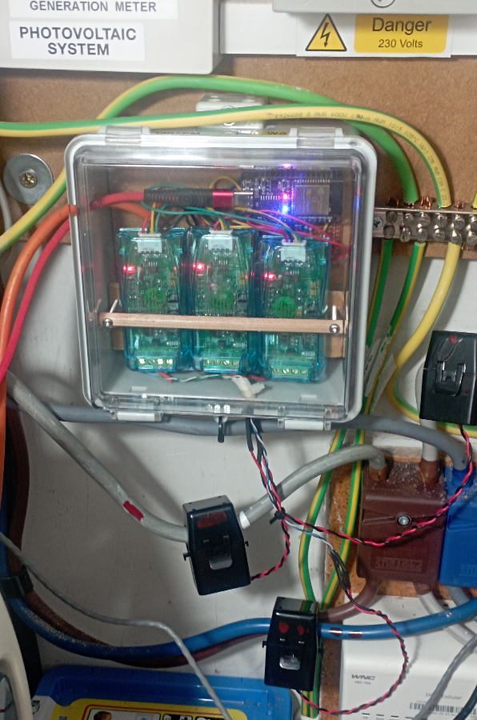

# ct3PZEM

A MicroPython-based electronic project using a PZEM energy monitoring module.

## Equipment

The assembled project showing the ESP32, PZEM module.

## Project Overview

This project uses an ESP32 to obtain electrical measurements from a PZEM energy monitoring module. The data can be processed and transmitted to other systems.

## Main Components

- ESP32
- PZEM energy monitoring module
- Power supply
- IP67 Waterproof Electrical Junction Box Outdoor Plastic Enclosure With Hasp Seal
- [Other component]

## Software

- MicroPython
- `ct3PZEM.py`
- and other shared modules

## Wiring

[Describe the connections here.]

## How It Works

[Brief explanation of the operation.]

## Installation

[Explain how to install the MicroPython files on the ESP32.]

## Configuration

[Explain any settings that need to be changed.]

## Version History

[Optional notes about significant changes.]
